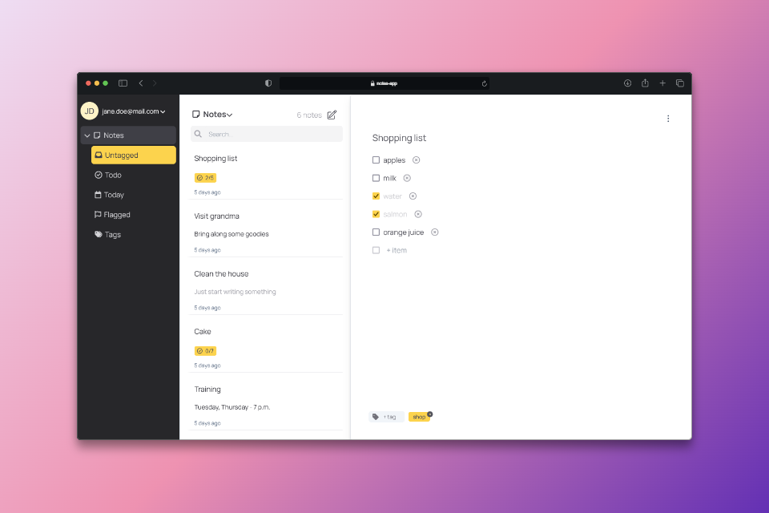

<div align="center">
  <h3 align="center">NotesApp</h3>

  <a href="https://notes-app-liard-mu.vercel.app/">
    
  </a>

  <p align="center">
    <a href="https://notes-app-liard-mu.vercel.app/">View Demo ➡️</a>
  </p>
</div>


<details>
  <summary>Table of Contents</summary>
  <ol>
    <li>
      <a href="#about-the-project">About The Project</a>
      <ul>
        <li><a href="#built-with">Built With</a></li>
      </ul>
    </li>
    <li>
      <a href="#getting-started">Getting Started</a>
      <ul>
        <li><a href="#prerequisites">Prerequisites</a></li>
        <li><a href="#installation">Installation</a></li>
      </ul>
    </li>
    <li><a href="#acknowledgments">Acknowledgments</a></li>
  </ol>
</details>


<!-- ABOUT THE PROJECT -->
## About The Project
NotesApp is a simple, yet powerful note-taking application designed to help you organize your thoughts, tasks, and ideas. This project is a clone of popular note-taking apps, providing a straightforward and intuitive interface for users to create, edit, and manage their notes.</br>
</br>
***Features***
* Create Notes: Quickly create notes with a simple and clean interface.
* Edit Notes: Modify existing notes with ease.
* Delete Notes: Remove notes that are no longer needed.
* Search Notes: Find specific notes quickly using the search functionality.
* Tag Notes: Add tags to notes for improved organization and easy retrieval.
* Filter Notes: Filter notes based on tags, type of notes, or other criteria to find exactly what you need.

### Built With
Frontend: </br>


[![React][React.js]][React-url]
[![Redux]][Redux-url]
[![React-Router]][React-Router-url]
[![tailwindcss]][tailwindcss-url]
[![Vite]][Vite-url]

Backend: </br>
[![expressjs]][expressjs-url]
[![Node.js]][Node.js-url]
[![Mongoose]][Mongoose-url]

Database:</br>
[![MongoDB]][MongoDB-url]


## Getting Started

### Prerequisites

* Install [![Docker]][Docker-url]
* Install [Make] [for Windows]
  
### Installation
1. Clone the repo
   ```sh
   git clone https://github.com/olga-ovseychik/notes-app.git
   ```
2. Be sure to create a database in MongoDB Atlas, get your own ATLAS_URI, generate Access & Refresh tokens keys and add you environment variables to your `.env` file. You can find an example of the `.env` file in the `example.env` file.
3. Run the command at the root of the repository to build images
   ```sh
   make build-dev
   ```
4. Run containers
   ```sh
   make run-dev
   ```


## Acknowledgments

* [Font Awesome](https://fontawesome.com)
* [Heroicons](https://heroicons.com/)
* [Badges](https://github.com/alexandresanlim/Badges4-README.md-Profile?tab=readme-ov-file#-frameworks--library-)


<!-- MARKDOWN LINKS & IMAGES -->
[React.js]: https://img.shields.io/badge/React-20232A?style=for-the-badge&logo=react&logoColor=61DAFB
[React-url]: https://reactjs.org/
[Redux-url]:https://redux.js.org/
[Redux]:https://img.shields.io/badge/Redux-593D88?style=for-the-badge&logo=redux&logoColor=white
[React-Router-url]:https://reactrouter.com/en/main
[React-Router]:https://img.shields.io/badge/React_Router-CA4245?style=for-the-badge&logo=react-router&logoColor=white
[tailwindcss-url]:https://tailwindcss.com/
[tailwindcss]:https://img.shields.io/badge/Tailwind_CSS-38B2AC?style=for-the-badge&logo=tailwind-css&logoColor=white
[Vite-url]:https://vitejs.dev/
[Vite]:https://img.shields.io/badge/Vite-B73BFE?style=for-the-badge&logo=vite&logoColor=FFD62E
[expressjs-url]:https://expressjs.com/
[expressjs]:https://img.shields.io/badge/Express%20js-000000?style=for-the-badge&logo=express&logoColor=white
[Node.js]:https://img.shields.io/badge/Node%20js-339933?style=for-the-badge&logo=nodedotjs&logoColor=white
[Node.js-url]:https://nodejs.org/
[Mongoose]:https://img.shields.io/badge/Mongoose-880000.svg?style=for-the-badge&logo=Mongoose&logoColor=white
[Mongoose-url]:https://mongoosejs.com/
[MongoDB-url]:https://www.mongodb.com/
[MongoDB]:https://img.shields.io/badge/MongoDB-4EA94B?style=for-the-badge&logo=mongodb&logoColor=white
[pnpm-url]:https://pnpm.io/
[pnpm]:https://img.shields.io/badge/pnpm-yellow?style=for-the-badge&logo=pnpm&logoColor=white
[Docker]: https://img.shields.io/badge/Docker-2CA5E0?style=for-the-badge&logo=docker&logoColor=white
[Docker-url]: https://www.docker.com/
[Make]:https://gnuwin32.sourceforge.net/packages/make.htm

